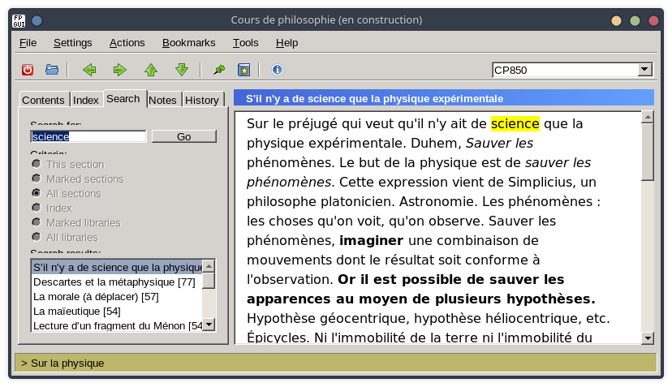

# Create a help file in IPF format from Markdown sources

Create a document in IPF format from Markdown sources, with a Lua script and a *Makefile*.

The IPF format (for *Information Presentation Facility*) was the format of [IBM help files](http://www.hypermake.com/english/n024.html#hd24).

## Markdown to IPF

The Mardown files are converted to a single IPF file by the script *md2ipf.lua*.

## IPF to INF

The IPF file is compiled to the INF binary format using [WIPFC](https://github.com/open-watcom/open-watcom-v2).

## DocView

The INF files can be opened in [DocView](https://github.com/graemeg/fpGUI/tree/develop/docview).



## User's guide

(Instructions for Linux.)

### Install wipfc

```bash
git clone https://github.com/open-watcom/open-watcom-v2.git
cd open-watcom-v2/bld/wipfc
./configure
make
sudo make install
```

### Install DocView

To do.

### Launch the final command

Once you have edited in *Makefile* the paths to *wipfc* and *DocView*, you can launch the final command.

```
make
```
