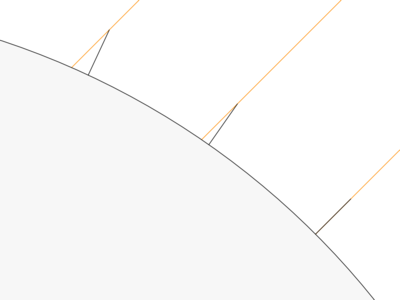

# De la terre

De la rondeur de la terre. De sa grandeur. Du mythe de la terre plate. Du mouvement de la terre.

Astronomes. Ératosthène. Copernic. Lalande.

Pierre Duhem, *La théorie physique : son objet, sa structure*.

## De la rondeur de la terre

On peut savoir que la terre est ronde sur la base de plusieurs **observations**.

Croissants de lune. Ombre de la terre.

Les vaisseaux vus de loin en pleine mer, disparaissent par degrés.

Copernic, *Des révolutions des orbes célestes*.

> Lorsque la terre n'est pas aperçue du navire, elle est vue du sommet du mât. Si l'on attache un feu au sommet du mât, celui-ci, lorsque le navire s'éloigne de la terre, paraît à ceux qui demeurent sur le rivage s'abaisser petit à petit, jusqu'à ce qu'il disparaisse enfin, comme s'il se couchait.

Observation de la hauteur méridienne du soleil.

Lalande, *Abrégé d'astronomie*, livre premier.

> L'observation de la hauteur méridienne du soleil en différents pays, fut la première chose qui dut apprendre aux hommes que la terre était ronde.

## De la grandeur de la terre

Le même moyen permet de connaître la grandeur de la terre.

C'est de ce moyen que s'est servi Ératosthène.

La circonférence de la terre est de **9000 lieues**, ou **360 fois la distance à vol d'oiseau de Paris à Amiens**. La latitude d'Amiens est plus grande que celle de Paris d'un degré.

La lieue commune de France valant exactement 4,4453 km, la circonférence de la terre est de 9000 x 4,4453 = 40007,7 km.

## Du mythe de la terre plate

Personne n'a jamais enseigné que la terre était plate.

Le mythe de la croyance médiévale en une terre plate est une invention de Voltaire (*Dictionnaire philosophique*, « Figure ou forme de la terre »).

C'est de ce même philosophe qu'est venue cette autre idée fausse, selon laquelle ce seraient les grands navigateurs qui auraient prouvé, par l'expérience, la sphéricité de la terre, en en faisant le tour.

## Du mouvement de la terre

Lieu commun.

> Autrefois on croyait que le soleil tournait autour de la terre. Maintenant on sait...

Mouvement absolu et mouvement relatif. On ne peut jamais observer qu'un mouvement relatif, c'est-à-dire le mouvement d'un corps par rapport à un autre corps qu'on **suppose** immobile.

Duhem, *Sauver les apparences. Sur la notion de théorie physique de Platon à Galilée.*

L'auteur survole l'histoire de l'astronomie de la Grèce antique jusqu'à Galilée, et examine la façon dont les astronomes ont conçu la physique, l'idée qu'ils se sont faite de la théorie physique. Les théories physiques sont-elles des vérités ? Ont-elles la prétention d'être vraies ?

Il y a des astronomes qui ont cru que le but de la physique n'était pas de nous faire connaître des vérités absolues, mais de « sauver les apparences ». C'est une expression d'un disciple de Platon.

Les apparences, ou les phénomènes. Dans la question, c'est la position du soleil dans le ciel. Sauver les apparences veut dire trouver un modèle mathématique. Ce qu'on peut observer, c'est le **mouvement relatif** de la terre et du soleil. Or ce mouvement peut être décrit aussi bien dans la théorie géocentrique que dans la théorie héliocentrique. Dans les deux cas, les apparences peuvent être sauvées. La théorie héliocentrique l'emporte par sa simplicité, puisqu'elle permet d'éliminer les épicycles.

Épicycles.

Sur le procès de Galilée. Ce qu'on reproche à Galilée, c'est précisément la prétention d'affirmer des vérités absolues, et non pas des hypothèses.

Lectures suggérées. Duhem, *La théorie physique,* chapitre III.  Du même auteur, *Sauver les apparences,* chapitre I.

Héraclide de Pont.

« C'est pour cela qu'Héraclide de Pont déclarait qu'il est possible de sauver l'irrégularité apparente du mouvement du Soleil en admettant que le Soleil demeure immobile et que la Terre se meut d'une certaine manière. Il n'appartient donc aucunement à l'astronome de connaître quel corps est en repos par nature, de quelle qualité sont les corps mobiles ; il pose à titre d'hypothèse que tels corps sont immobiles, que tels autres sont en mouvement, et il examine quelles sont les suppositions avec lesquelles s'accordent les apparences célestes. »

Duhem, *Sauver les phénomènes*. Le but de la physique est de *sauver les phénomènes*. Cette expression vient de Simplicius, un philosophe platonicien. Astronomie. Les phénomènes : les choses qu'on voit, qu'on observe. Sauver les phénomènes, **imaginer** une combinaison de mouvements dont le résultat soit conforme à l'observation. **Or il est possible de sauver les apparences au moyen de plusieurs hypothèses.** Hypothèse géocentrique, hypothèse héliocentrique, etc. Épicycles. Ni l'immobilité de la terre ni l'immobilité du soleil ne sont des vérités.

## Texte 1

Lalande, *Abrégé d'astronomie*, livre premier.

> L'observation de la hauteur du pôle et de la hauteur de l'équateur, ou, si l'on veut, de la hauteur méridienne du soleil en différents pays, fut la première chose qui dut apprendre aux hommes que la terre était ronde. Ce fut d'abord par l'ombre du soleil que l'on détermina les différences de hauteurs du pôle ; plus on avançait vers le nord, plus ces ombres mesurées le même jour se trouvaient longues ; ce qui prouvait que la hauteur du soleil au-dessus de l'horizon était devenue plus petite, et que l'observateur situé vers le nord n'était pas sur le même plan que l'observateur situé vers le midi. On dut en conclure que la terre était arrondie.
> L'ombre de la terre dans les éclipses de lune paraît toujours ronde ; les vaisseaux vus de loin en pleine mer, disparaissent par degrés ; et on les voit descendre et se perdre peu à peu, par la courbure de la surface des eaux. Telles furent les marques auxquelles les anciens philosophes reconnurent la courbure et la rondeur de la terre.
> Après avoir ainsi reconnu la rondeur de la terre, on se servit du même moyen pour connaître sa grandeur : et le changement des latitudes et des hauteurs, soit du pôle, soit des astres, servit à connaître l'étendue de notre globe en en mesurant une petite partie [...].
> Autre exemple : on trouve en allant vers le nord que la latitude d'Amiens est plus grande que celle de Paris d'un degré, ou que le soleil à midi est d'un degré plus bas à Amiens qu'à Paris ; c'est une preuve que la terre a un degré de courbure depuis Paris jusqu'à Amiens ; or cette distance mesurée en allant toujours du midi au nord, s'est trouvée de 25 lieues, chacune de 2283 toises ; donc un degré de la terre, ou la 360e partie de toute sa circonférence, a 25 lieues d'étendue ; d'où il suit que la circonférence entière ou le tour de la terre vaut 9000 lieues ; car 25 fois 360 font 9000.
